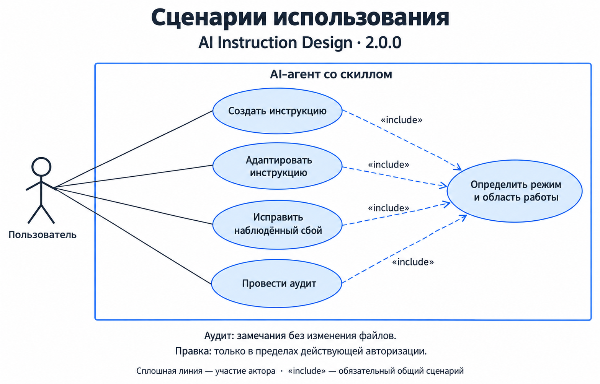
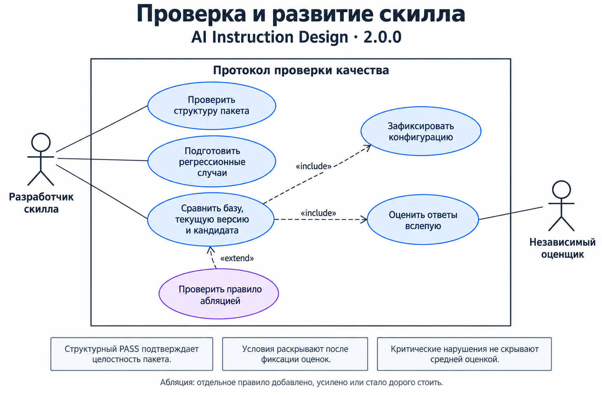

# AI Instruction Design

**Версия 2.0.0**

Скилл для проектирования, адаптации и аудита текстов, которые управляют моделью: системных промптов, инструкций нод n8n, `AGENTS.md`, `CLAUDE.md`, других скиллов, описаний инструментов, планов, файлов состояния, хендоффов и инструкций оценщикам.

Рабочий пакет находится в [skills/ai-instruction-design/](skills/ai-instruction-design/). [SKILL.md](skills/ai-instruction-design/SKILL.md) задаёт обязательные границы и выбирает нужные справочники. Обычная проза, README и промпты для генераторов изображений находятся за пределами применения скилла.

## Возможности

| Задача | Что делает скилл |
|---|---|
| Создать инструкцию | Задаёт цель, входы, выходы, полномочия, маршруты, критерии успеха и безопасного отказа. |
| Адаптировать инструкцию | Учитывает новые требования или среду, сохраняя совместимые правила и границы авторизации. |
| Исправить сбой | Связывает наблюдённый дефект с его причиной и выбирает минимальное связное исправление. |
| Провести аудит | Находит противоречия, пробелы и риски, приводит свидетельства и рекомендации в пределах порученной проверки. |

При переписывании скилл помогает сохранить смысл, силу и условия требований, точные литералы и зависимости. Для существенных изменений используется карта соответствия исходной и новой версии. Аудит различает подтверждённые противоречия, риски, требующие проверки поведения, и необязательные улучшения.

Пять профилей уточняют работу с системными промптами, скиллами, описаниями инструментов, состоянием и хендоффами, инструкциями оценщикам. Правила отдельно рассматривают доверие к источникам, действующие разрешения и контроль исполнения рискованных действий.

Для проверки пакета предусмотрены офлайн-валидатор и набор из 22 регрессионных случаев в 17 семействах. Протокол поведенческой оценки описывает сравнение версий, слепую оценку, проверку критических срезов и необходимость отдельных правил.

## Использование

Для аудита:

> Примени ai-instruction-design к моему системному промпту. Проверь требования, противоречия и безопасность. Выдай замечания со свидетельствами. Файлы не изменяй.

Для исправления:

> Исправь перечисленные замечания в prompt.md. Остальные требования сохрани, покажи карту изменений и проверь итоговый текст.

Для адаптации:

> Адаптируй инструкцию под новую схему входа. Сохрани границы авторизации и пути отказа. Изменяй только указанный файл.

Для создания:

> Спроектируй инструкцию для агентной ноды: вот её цель, входы, инструменты и разрешения. Задай контракт и критерии приёмки.

Скилл не выдаёт себе дополнительных прав. Авторизация задаётся доверенным запросом и средой. Проверяемые документы, примеры и результаты инструментов остаются данными, даже если содержат команды.

В чате без установки приложите основной файл и справочники выбранного маршрута. Пути и доступность вложений нужно сохранить либо явно сопоставить; один основной файл не заменяет обязательный материал выбранного режима.

## UML: варианты использования

Диаграммы показывают задачи, которые пользователь решает через AI-агента со скиллом, и отдельные сценарии проверки качества. Сплошные линии связывают акторов со сценариями; `«include»` обозначает обязательный общий сценарий, `«extend»` — условное расширение.

### Работа с инструкцией

Пользователь выбирает создание, адаптацию, исправление наблюдённого сбоя или аудит. Во всех сценариях агент определяет режим и область работы. Аудит выдаёт замечания; изменение артефакта выполняется в пределах действующей авторизации.



### Проверка и развитие скилла

Разработчик проверяет структуру пакета, готовит регрессионные случаи и организует сравнение трёх условий. Сравнение включает фиксацию конфигурации и слепую оценку ответов независимым оценщиком. При проверке необходимости отдельного правила сравнение расширяется абляцией.



Изображения хранятся в репозитории отдельно от пакета скилла. [Исходные задания на генерацию](docs/diagrams/generation-prompts.json) фиксируют подписи, состав сценариев и оформление.

## Установка

Скопируйте каталог `skills/ai-instruction-design` целиком в каталог скиллов выбранной среды. Внутри должны сохраниться `SKILL.md`, `LICENSE`, `references/`, `scripts/` и `tests/`.

| Среда | Локальная установка для пользователя | Документация |
|---|---|---|
| Codex | `~/.agents/skills/ai-instruction-design/` | [Codex skills](https://learn.chatgpt.com/docs/build-skills) |
| Claude Code | `~/.claude/skills/ai-instruction-design/` | [Claude Code skills](https://code.claude.com/docs/en/skills) |
| Cursor | `~/.cursor/skills/ai-instruction-design/` | [Cursor skills](https://cursor.com/docs/skills) |
| OpenCode | `~/.config/opencode/skills/ai-instruction-design/` | [OpenCode skills](https://opencode.ai/docs/skills/) |

Пример первой установки для Codex из корня этого репозитория:

```bash
mkdir -p ~/.agents/skills
cp -R skills/ai-instruction-design ~/.agents/skills/
```

В PowerShell:

```powershell
$skillParent = Join-Path $env:USERPROFILE '.agents/skills'
New-Item -ItemType Directory -Path $skillParent -Force | Out-Null
Copy-Item -LiteralPath './skills/ai-instruction-design' -Destination $skillParent -Recurse
```

При обновлении замените ранее установленную папку пакетом новой версии, сохранив собственные доработки отдельно. Каталоги в таблице относятся к локальной установке; для проектной или облачной установки следуйте документации среды.

Описание во фронтматтере помогает среде выбрать скилл. Основной файл задаёт маршрут; детали читаются по условиям в его таблице. Наличие файла в папке само по себе не доказывает, что он загружен и выполнен.

## Проверка

Нужен Python 3.10 или новее. Команды выполняются из корня репозитория:

```bash
python -B skills/ai-instruction-design/scripts/validate.py
python -B -m unittest discover -s skills/ai-instruction-design/tests -p "test_*.py"
```

На Windows можно заменить `python` на `py -3`. Машиночитаемый отчёт:

```bash
python -B skills/ai-instruction-design/scripts/validate.py --json
```

Валидатор проверяет UTF-8, обязательные поля фронтматтера, версию, локальные ссылки и якоря, границы путей, структуру случаев, уникальность идентификаторов и заявленные связи вариантов. Код возврата: `0` при успехе, `1` при ошибках. Он работает только с локальными файлами и не вызывает модель.

[test cases](skills/ai-instruction-design/tests/cases.json) содержат входы отдельно от рубрики. При поведенческом прогоне испытуемому передаются запрос, сырые артефакты и контекст; ожидаемые решения остаются у организатора и оценщика. Протокол в [evaluation.md](skills/ai-instruction-design/references/evaluation.md) задаёт фиксацию конфигурации, слепую оценку, критические срезы и проверку вариантов. Структурный PASS означает целостность пакета; качество решений оценивается по ответам, действиям и исходам задач.

## Структура

```text
skills/ai-instruction-design/
├── SKILL.md
├── LICENSE
├── references/
│   ├── classes.md          сила правил и статус знания
│   ├── design.md           контракт, паспорт и режимы
│   ├── controls.md         контроль, авторизация и безопасность
│   ├── state.md            состояние, компакция и хендофф
│   ├── form.md             форма и сохранение требований
│   ├── diagnostics.md      диагностика и адаптация
│   ├── review.md           аудит и приёмка
│   ├── profiles.md         пять профилей артефактов
│   └── evaluation.md       оценка, регрессии и абляция
├── scripts/
│   └── validate.py
└── tests/
    ├── cases.json
    ├── migration-v2.md
    └── test_validate.py
```

В [examples/](examples/) лежат разборы применения свода к промптам: исходники, замечания и переработанные версии. Примеры отделены от самого скилла и от набора регрессионных случаев.

## Источник и лицензия

Связанный идейный источник: [Anbeeld/PROMPTING.md](https://github.com/Anbeeld/PROMPTING.md). Этот проект оформляет правила на русском языке и добавляет маршруты, профили и локальную проверку пакета.

MIT: [LICENSE](LICENSE). Копия лицензии входит в устанавливаемый каталог скилла.

## Что исправлено

- **Аудит отделён от редактирования.** Ревью выдаёт замечания и варианты исправления. Принятие замечания человеком или оценщиком не разрешает запись в файлы; действующее поручение на правку учитывается отдельно.
- **Определена сила правил без метки.** Прямое предписание из уполномоченного источника означает требование. Метки уточняют силу при неоднозначности; капслок и эмоциональные усиления не создают гарантий выполнения.
- **Разделены факты и неопределённость.** `ФАКТ СРЕДЫ:`, `ДОПУЩЕНИЕ:` и `НЕПРОВЕРЕНО:` обозначают статус знания отдельно от обязательности правила. Недоступность источника и отсутствие результата поиска не доказывают, что объект не существует.
- **Уточнены границы контроля.** Схема проверяет структуру, доменный валидатор — значения, авторизация — право на действие. При отсутствии обязательного контроля останавливается зависимое опасное действие; разрешённые анализ и черновик продолжаются.
- **Убраны лишние повторные подтверждения.** Разрешение связано с доверенным источником, операцией, объектом, существенными параметрами, сроком и отзывом. Оно используется в действующей области; более строгие условия, включая отдельное согласие на каждый платный запуск, сохраняются.
- **Различаются чтение и побочные эффекты.** Внешний поиск сам по себе не равен публикации или отправке сообщения. Доступ, передача чувствительных данных и стоимость проверяются отдельно.
- **Уточнены жизненный цикл и загрузка.** Компакция, память и хендофф не расширяют полномочия. Пути разрешаются относительно ссылающегося файла; при отсутствии обязательного ресурса явно ограничивается зависимая часть работы.
- **Удалены необоснованные обобщения.** Нет универсальных утверждений о доле неработающих инструкций, главной причине потери плана и порядке падения метрик. Ожидаемый эффект изменения отделён от наблюдаемого результата.
- **Исправлено описание установки и состава пакета.** Каталоги установки снабжены ссылками на документацию сред, устранены фиксированные обещания объёма загрузки, лицензия включена в устанавливаемую папку.

Карта существенных требований версии 1 и их выражения в версии 2: [migration-v2.md](skills/ai-instruction-design/tests/migration-v2.md).

## Что нового

- **Четыре режима:** аудит, исправление наблюдённого сбоя, адаптация к новым требованиям и создание. Для адаптации не требуется придумывать прошлый инцидент.
- **Восстановление контракта перед сложной работой:** цель, область, входы, выходы, полномочия, исключения, зависимости и пути отказа. Интерпретация исходника отделена от новых предложений.
- **Карта сохранения требований:** исходное требование → новая формулировка → сохранено / изменено / удалено / добавлено → основание и авторизация изменения. Для малой правки достаточно краткого сопоставления.
- **Пять профилей артефактов:** системный промпт, скилл, описание инструмента, пакет состояния или хендофф, инструкция оценщику. Применяется соответствующий профиль.
- **Три класса замечаний:** подтверждённое противоречие, риск, требующий поведенческой проверки, необязательное улучшение. Для каждого указываются свидетельство, серьёзность, затронутый контракт и исправление; пустой список замечаний допустим.
- **Протокол оценки:** сравнение без скилла, текущей версии и кандидата; слепая оценка с последующим раскрытием условий, сохранение конфигурации и трасс, отдельная проверка критических срезов.
- **Метаморфические случаи и абляция:** парафраз, форматирование, перестановка независимых правил и нерелевантные добавления должны сохранять существенное решение. Намеренная смена смысла меняет ожидания; удаление отдельного правила проверяет его необходимость.
- **Локальный набор регрессий:** 22 случая в 17 семействах с сырыми входами, разрешениями, обязательными решениями и запрещёнными действиями.
- **Офлайн-валидатор и его тесты:** проверка структуры пакета и данных случаев средствами стандартной библиотеки Python, без исполнения команд из тестовых артефактов.
